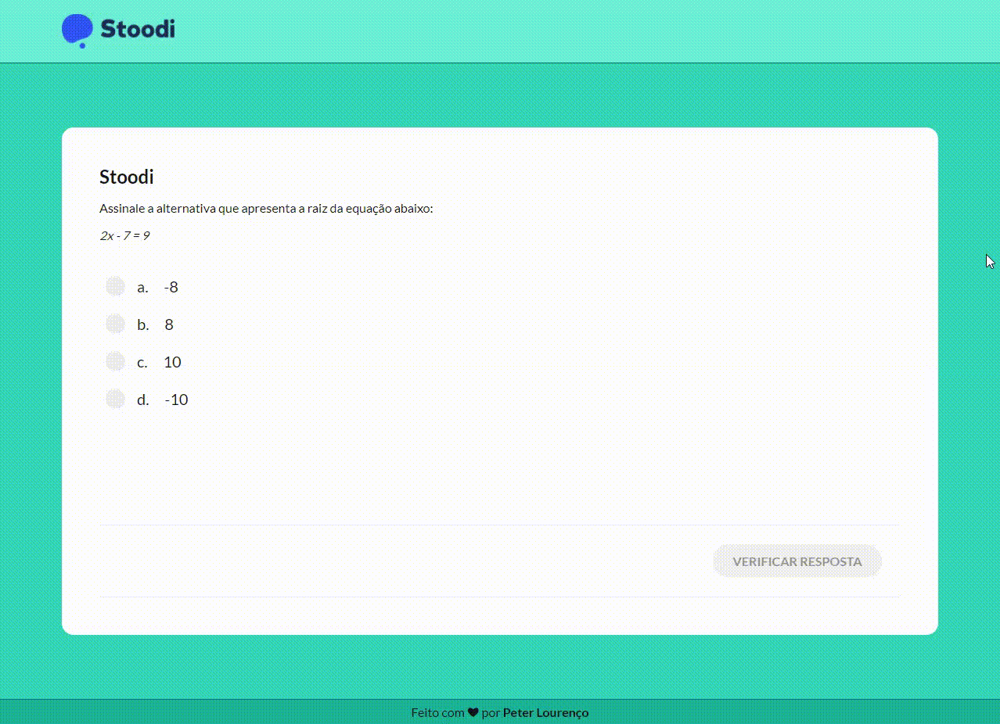

<h1>Stoodi Challenge</h1>

<p align="center">
  
  
  
</p>

> Status do Projeto: :warning: (em análise).

### Projeto desenvolvido por Peter Lourenço - lourenco.pet@gmail.com

### Tópicos

:small_blue_diamond: [Descrição do projeto](#descrição-do-projeto)

:small_blue_diamond: [Layout da Aplicação](#layout-da-aplicação)

:small_blue_diamond: [Pré-requisitos](#pré-requisitos)

:small_blue_diamond: [Como rodar a aplicação](#como-rodar-a-aplicação-arrow_forward)

:small_blue_diamond: [Licença](#licença)

## Descrição do projeto

<p align="justify">
  O objetivo do projeto é o de avaliar o método usado para solucionar um caso de uso da empresa. Em uma questão de múltipla escolha, o usuário deveria poder selecionar uma resposta, e caso estivesse errada, refazer a questão.
</p>

## Layout da Aplicação



## Pré-requisitos

:warning: [Node](https://nodejs.org/en/download/)

## Como rodar a aplicação :arrow_forward:

No terminal, clone o projeto:

```
git clone https://github.com/petlou/stoodi-frontend-challenge.git
```

Nesse projeto, utilizei o [Yarn](https://classic.yarnpkg.com/lang/en/docs/install/#windows-stable) como Package Manager, mas pode executar através do [NPM](https://www.npmjs.com/) sem problemas. <br>

Para instalar as dependências rode o comando:

```
yarn
```

Após executado rode o seguinte para iniciar o projeto:

```
yarn dev
```

O projeto deverá ser executado em:

```
http://localhost:3000/
```

## Licença

The [MIT License](https://www.mit.edu/~amini/LICENSE.md) (MIT)

Copyright :copyright: 2022 - Stoodi Chalenge
